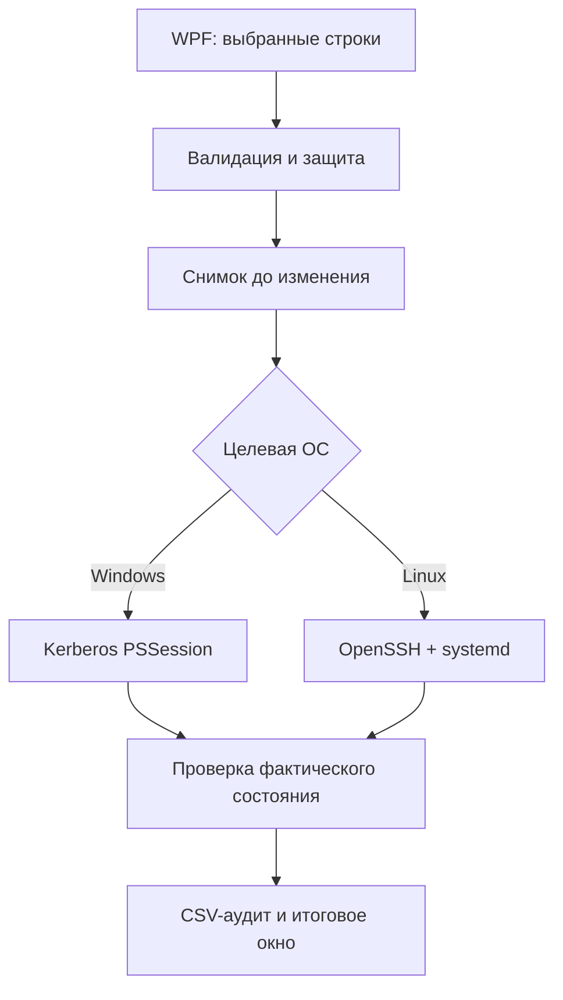

# Карта проекта

Актуально для версии **2.2.0**. Этот документ — первая точка входа для разработчика или ИИ перед изменением проекта.

## Назначение

Программа запускается на Windows и предоставляет единый WPF-интерфейс для:

- управления службами Windows через WinRM/WS-Man и Kerberos;
- управления systemd-службами Linux через OpenSSH;
- мониторинга процессов Windows и Linux;
- безопасного завершения процессов;
- диагностики, снимков, отката и аудита операций.

## Структура

| Путь | Ответственность | Когда изменять |
|---|---|---|
| `Remote-Service-Manager.ps1` | WPF-интерфейс, состояние приложения, Windows-транспорт, общая бизнес-логика | Интерфейс, Windows, общие операции |
| `Linux-Remote.ps1` | OpenSSH, systemd, Linux-процессы и диагностика | Любое поведение Linux |
| `service-groups.json` | Порядок, названия и маски групп; дополнительные защищённые службы | Новые EAS4/MARS/службы или категории |
| `Запустить.bat` | Единственная пользовательская точка запуска и SHA-256 проверка | Изменился исполняемый PS1 или запуск |
| `VERSION.txt` | Машиночитаемая версия и краткий набор возможностей | Каждый релиз поведения |
| `README.md` | Краткая страница GitHub и ссылка на дистрибутив | Пользовательские возможности/релиз |
| `README.txt` | Подробная инструкция внутри ZIP | Пользовательские сценарии |
| `LINUX_SETUP.txt` | Подготовка OpenSSH, ключей, systemd и sudo | Требования Linux/SSH |
| `CODE_AUDIT.md` | Зафиксированные результаты последнего аудита | После аудита или исправления риска |
| `CHANGELOG.md` | История релизов в обратном порядке | Каждый релиз |
| `docs/ARCHITECTURE.md` | Компоненты, состояния и потоки команд | Изменение архитектуры |
| `docs/SECURITY.md` | Модель угроз и обязательные защиты | Изменение транспорта/прав |
| `docs/TESTING.md` | Автоматические и ручные проверки | Новая функция или способ проверки |
| `docs/DECISIONS.md` | Почему выбраны текущие решения | Архитектурное решение или компромисс |
| `docs/DOCUMENTATION_POLICY.md` | Правила и матрица обновления документов | Меняется процесс сопровождения |
| `AGENTS.md` | Общие правила для Codex и других агентов | Только постоянные правила проекта |
| `CLAUDE.md` | Подключение общих правил в Claude Code | Только Claude-специфичное поведение |
| `dist/` | Готовые архивы релизов | Только после успешной проверки |

## Карта основного скрипта

### Инициализация

1. Загружаются WPF-сборки и XAML.
2. Находятся именованные элементы интерфейса.
3. Создаётся состояние текущего соединения, служб и процессов.
4. Версия читается из `VERSION.txt`.
5. Рабочая папка назначается в `%LOCALAPPDATA%\RemoteServiceManager`.
6. Загружается `Linux-Remote.ps1`.
7. Загружается и проверяется схема `service-groups.json`.

### Общая инфраструктура

- `Write-Log` — журнал текущего окна.
- `Write-Audit` — постоянный CSV-журнал операций.
- `ConvertTo-SafeCsvRecord` — защита CSV от формул Excel.
- `Set-Busy` — единое включение/выключение элементов на время операции.
- `Clear-ConnectionState` — закрытие сессии и очистка устаревших данных.
- `Show-OperationResultWindow` — итоговое окно пакетной операции.

### Windows

- `Test-WindowsTargetName` запрещает IP и некорректные DNS-имена.
- `Connect-RemoteSession` создаёт постоянную Kerberos PSSession.
- `Get-RemoteParameters` восстанавливает разорванную сессию.
- `Invoke-RemoteCommand` запускает ограниченное по времени WinRM-задание.

### Службы

- `Load-Services` получает полный список и нормализует модель Windows/Linux.
- `Get-ServiceGroup` применяет первую совпавшую маску из JSON.
- `Update-Grid` применяет поиск, состояние, группу и сортировку.
- `Invoke-ServiceAction` маршрутизирует Start/Stop/Restart.
- `Set-SelectedStartupType` меняет тип запуска.
- `Save-ServiceSnapshot` и `Restore-LastSnapshot` реализуют откат.
- `Diagnose-SelectedServices` собирает зависимости и события/журнал.
- `Test-IsProtectedService` проверяет встроенную и настраиваемую защиту.

### Процессы

- `Load-Processes` получает очередной снимок и рассчитывает показатели.
- `Update-ProcessGrid` применяет поиск и обновляет таблицу.
- `Stop-SelectedProcesses` подтверждает операцию, повторно сверяет PID и журналирует результат.
- `DispatcherTimer` задаёт интервалы 2/5/10/30 секунд.

## Карта Linux-модуля

- `Assert-LinuxConnectionSettings` — валидация адреса, пользователя, порта и ключа.
- `Invoke-LinuxSshCommand` — единственная точка запуска `ssh`; BatchMode, тайм-ауты и строгий host key.
- `Test-LinuxConnection` — проверка systemd и обязательных утилит.
- `Get-LinuxServiceInventory` — нормализованный список systemd units.
- `Invoke-LinuxSystemctlAction` — start/stop/restart.
- `Set-LinuxStartupType` — enable/disable/mask/unmask.
- `Get-LinuxProcessInventory` — процессы и интервальная загрузка CPU.
- `Stop-LinuxProcessBatch` — повторная сверка PID и SIGTERM.
- `Get-LinuxServiceDiagnostics` — systemctl status и journalctl.

## Поток команды

## Состояние приложения

| Переменная | Смысл | Сбрасывается при переподключении |
|---|---|---|
| `$script:ConnectedComputer` | Текущая цель | Да |
| `$script:TargetPlatform` | Windows или Linux | Назначается заново |
| `$script:Session` | Постоянная Windows PSSession | Да |
| `$script:AllServices` | Полный нормализованный список служб | Да |
| `$script:AllProcesses` | Последний снимок процессов | Да |
| `$script:ActiveWinRmJob` | Активная WinRM-операция | Прерывается |
| `$script:ActiveSshProcess` | Активный процесс ssh | Завершается |
| `$script:LinuxProcessSamples` | Предыдущие счётчики CPU Linux | Да |
| `$script:LastSnapshotPath` | Последний снимок для отката | Проверяется по цели |

## Данные и границы доверия

- Ввод пользователя: компьютер, Linux-пользователь, порт, путь ключа, отмеченные объекты.
- Удалённые данные: названия, описания, пути, состояния, PID и сообщения ошибок.
- Конфигурация: локальный JSON, редактируемый пользователем.
- Секреты: программа не хранит пароль Windows, SSH или sudo.
- Выходные данные: журнал и снимки в LocalAppData; пользовательский CSV по выбранному пути.

Любые новые данные на этих границах должны валидироваться до использования в WinRM, SSH, имени файла или CSV.

## Порядок безопасного изменения

1. Найти владельца поведения по таблице структуры.
2. Проверить ограничения в `docs/SECURITY.md`.
3. Изменить минимальное число модулей.
4. Выполнить проверки из `docs/TESTING.md`.
5. Обновить карту, если изменились модули, поток данных или состояние.
6. Обновить версию и changelog только при изменении поведения.
7. Пересчитать BAT-хеши и заново собрать ZIP, если изменились PS1.
